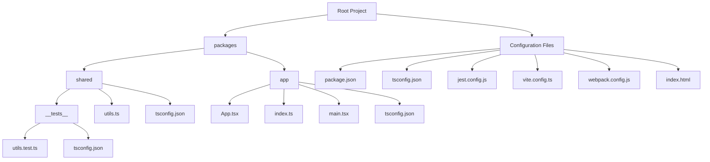

# Project Structure Visualization

```mermaid
graph TD
    A[Root Project] --> B[packages]
    A --> C[Configuration Files]
    B --> D[shared]
    B --> E[app]
    D --> F[__tests__]
    D --> G[utils.ts]
    D --> H[tsconfig.json]
    E --> I[App.tsx]
    E --> J[index.ts]
    E --> K[main.tsx]
    E --> L[tsconfig.json]
    F --> M[utils.test.ts]
    F --> N[tsconfig.json]
    C --> O[package.json]
    C --> P[tsconfig.json]
    C --> Q[jest.config.js]
    C --> R[vite.config.ts]
    C --> S[webpack.config.js]
    C --> T[index.html]
```